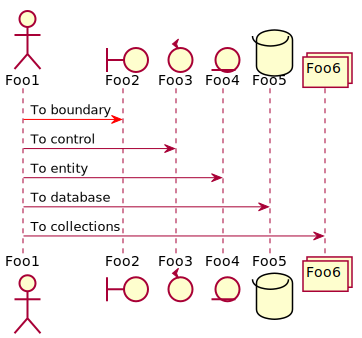
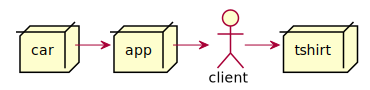

# Example

```
@startuml
actor Foo1
boundary Foo2
control Foo3
entity Foo4
database Foo5
collections Foo6
Foo1 -> Foo2 : To boundary
Foo1 -> Foo3 : To control
Foo1 -> Foo4 : To entity
Foo1 -> Foo5 : To database
Foo1 -> Foo6 : To collections
@enduml
```



```
@startuml
actor client
node app
node car
node tshirt

car -> app
app -> client
client -> tshirt
@enduml
```


